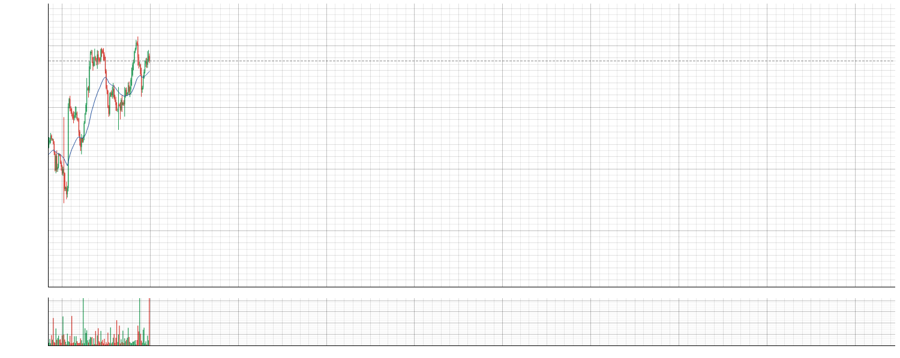

# ZeroDTE Replay — a flight simulator for 0DTE options day traders

Practice intraday 0DTE options trading against **blind-picked, second-by-second replay sessions** —
with a one-click order panel, realistic next-second fills, and a forced review loop
(grade every session A/B/C + write what you'd change).

No account. No API key. No market-data subscription. Download and train.



## Why

Day trading 0DTE is a performance skill. Like a pilot, you need *reps* — but live reps cost real
money and only come one trading day per day. ZeroDTE Replay gives you deliberate practice:

- **Blind sessions** — you don't know if the day trends, chops, or gaps until you trade it.
  Each session appears once per round, so you can't memorize the deck.
- **Real-time pressure** — replay at 0.5x–10x. The clock only moves forward; no rewinding
  out of a bad entry (jumps forward are allowed, backward while holding is not).
- **Honest fills** — orders fill at the *next second's* model mid-quote. You never trade on
  a price you've already seen.
- **The review loop** — every session ends with a grade + notes, archived as
  `trading_log/<session>/T<attempt>_<grade>_<minutes>_<speed>x.csv/.txt`. Your journal is the product.

## Quick start

```bash
pip install -r requirements.txt
python app.py
```

1. Click **🎲 New Session** → a session is blind-picked (reroll if you like) → OK.
2. The chart arms at your chosen start time. Press **▶ Start** when ready.
3. Trade from the **🎯 Order Panel**: BUY CALL / BUY PUT (nearest OTM, add-ons at the same
   strike), CLOSE closes the whole side. Watch your held option's price from second 0.
4. Press **⏹ End** (or let it run to the close) → grade the session → it's archived.

## The data (read this)

The bundled sessions are **fully synthetic**. Price paths are generated from anonymized
intraday volatility profiles plus fresh random noise (correlation with any real session ≈ 0),
and option quotes are Black-Scholes model prices with a realistic intraday IV path and skew.
They *feel* like real 0DTE tape — open burst, lunch lull, closing ramp, gamma behavior —
but they are **not real market data** and are licensed for unrestricted use with this app.

Want to train on real historical sessions? That's what we're building next — join the waitlist
by opening an issue or watching this repo. (Real-data mode requires licensed market data;
we're doing that properly.)

## Disclaimers

Educational software. Not investment advice. Simulated fills (model mid, no spread/slippage)
are optimistic versus live trading. Past performance — simulated or real — does not guarantee
future results. Options involve substantial risk of loss.

## License

MIT — see [LICENSE](LICENSE).
