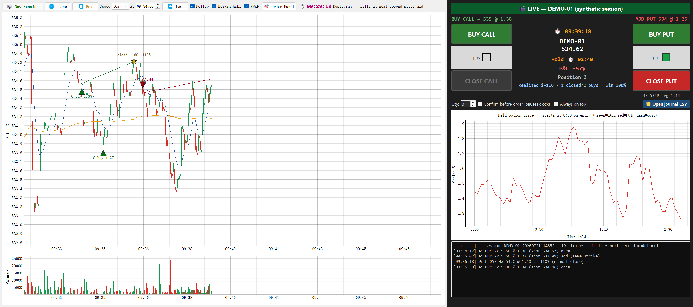

# ZeroDTE Replay — a flight simulator for 0DTE options day traders

Practice intraday 0DTE options trading against **blind-picked, second-by-second replay sessions** —
with a one-click order panel, realistic next-second fills, and a forced review loop
(grade every session A/B/C + write what you'd change).

No account. No API key. No market-data subscription. Download and train.



*Live session: two CALL entries (▲) averaged at the same strike, closed 4x for +$106 (★, dashed
line = the round trip), then 3x PUTs opened (▼) — panel showing live P&L, position size, hold
timer, and the held option's price path from second 0 with the cost line.*

## Why

Day trading 0DTE is a performance skill. Like a pilot, you need *reps* — but live reps cost real
money and only come one trading day per day. ZeroDTE Replay gives you deliberate practice:

- **Blind sessions** — you don't know if the day trends, chops, or gaps until you trade it.
  Each session appears once per round, so you can't memorize the deck.
- **Real-time pressure** — replay at 0.5x–10x. The clock only moves forward; no rewinding
  out of a bad entry (jumps forward are allowed, backward while holding is not).
- **Honest fills** — orders fill at the *next second's* model mid-quote. You never trade on
  a price you've already seen.
- **The review loop** — every session ends with a grade + notes, archived as
  `trading_log/<session>/T<attempt>_<grade>_<minutes>_<speed>x.csv/.txt`. Your journal is the product.

## Quick start

**Windows — no install:** download `ZeroDTE-Replay.exe` from
[**Releases**](https://github.com/Tommie-He/zero-dte-replay/releases) and double-click.
(First launch takes a few seconds to unpack. If SmartScreen warns about an unknown
publisher, choose "More info → Run anyway" — the source you're looking at is what's inside.)

**Any OS — from source:**

```bash
pip install -r requirements.txt
python app.py
```

1. Click **🎲 New Session** → a session is blind-picked (reroll if you like) → OK.
2. The chart arms at your chosen start time. Press **▶ Start** when ready.
3. Trade from the **🎯 Order Panel** (see below).
4. Press **⏹ End** (or let it run to the close) → grade the session → it's archived.

## No option chain. On purpose.

Real trading platforms make you work through an option chain, a T-style quote board,
expiration menus and strike pickers before you can even click buy. For 0DTE momentum
trading that friction *is* the mistake — by the time you've found your contract, the move
is gone. ZeroDTE Replay deliberately strips all of it:

- **No chain, no T-board, no contract hunting.** Every buy is simply the 0DTE contract
  **at the money** — the nearest out-of-the-money strike is auto-selected the instant
  you click, and its live quote is already on the button.
- One decision only: **direction and timing.** Which is exactly the skill you're here to train.

## Fills you can trust

The fill methodology is inherited from the quantitative backtesting engine this tool grew
out of, where the iron rule is: *quotes are NBBO, and you fill at the **next second** —
never at a price you have already seen.*

- Quotes shown are mid prices on a per-second grid, in sync with the chart.
- Your order fills at the mid **one second after** your click. No look-ahead, ever.
- In this free demo the quotes are model-generated (synthetic sessions, Black-Scholes with
  a realistic intraday IV path). The **real-data edition** (in the works) replays actual
  historical **NBBO quotes**, so fills reflect true market conditions second by second —
  same mechanics, real tape.

## How the order panel works

Modeled on a real one-click 0DTE panel — two buttons per side, zero order-ticket friction:

- **BUY CALL / BUY PUT** buys the **nearest out-of-the-money 0DTE contract**: for calls, the
  lowest strike *above* spot; for puts, the highest strike *below* spot. The target strike and
  its live quote are always shown above the button (`BUY CALL → 535 @ 1.37`).
- **Adding while holding buys the *same* strike** (no accidental strike ladder) and updates
  your average cost — the dashed cost line on the option chart moves with it.
- **CLOSE closes the entire side at once.** There is no sell-to-open; you can never end up
  short an option by accident.
- **Fills are honest**: your order fills at the model mid **one second after** your click.
  You never trade on a price you've already seen — same rule as the backtests this tool grew out of.
- **Live position readout**: merged P&L (mark-to-mid), position size, hold timer, and a chart
  of your held option's price that starts at 0:00 the moment you enter — so "what has this
  contract done since *my* entry" is always one glance away.
- **Every fill is journaled** (`trading_log/journal.csv`) with sim-time, strike, qty, fill,
  spot, realized P&L and hold seconds.

## The data (read this)

The bundled sessions are **fully synthetic**. Price paths are generated from anonymized
intraday volatility profiles plus fresh random noise (correlation with any real session ≈ 0),
and option quotes are Black-Scholes model prices with a realistic intraday IV path and skew.
They *feel* like real 0DTE tape — open burst, lunch lull, closing ramp, gamma behavior —
but they are **not real market data** and are licensed for unrestricted use with this app.

Want to train on real historical sessions? That's what we're building next — join the waitlist
by opening an issue or watching this repo. (Real-data mode requires licensed market data;
we're doing that properly.)

## Disclaimers

Educational software. Not investment advice. Simulated fills (model mid, no spread/slippage)
are optimistic versus live trading. Past performance — simulated or real — does not guarantee
future results. Options involve substantial risk of loss.

## License

MIT — see [LICENSE](LICENSE).
